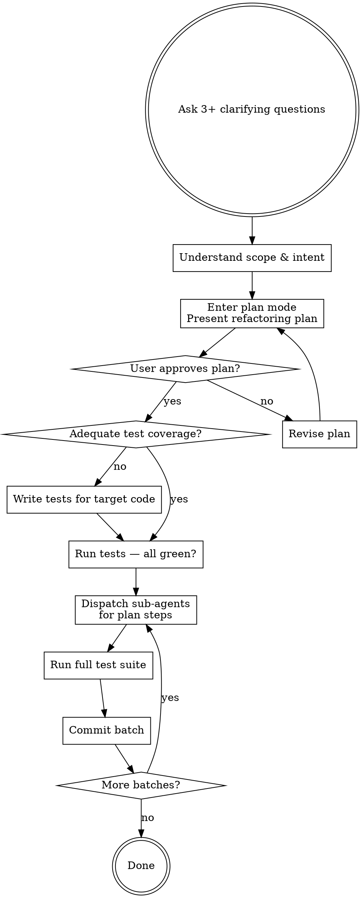

# Python Refactor

Carefully restructure Python code to improve readability, maintainability, and design — without changing external behavior. This is a disciplined process, not freeform editing.

## The Golden Rules

1. **Behavior is preserved** — Refactoring changes structure, never what the code does
2. **Small steps** — Make tiny, verifiable changes; never a big-bang rewrite
3. **Version control is your friend** — Commit before and after each safe state
4. **Tests are essential** — Without tests, you're not refactoring, you're just editing
5. **One thing at a time** — Never mix refactoring with feature changes or bug fixes

## Workflow

## Phase 1: Understand Intent

Before touching any code, ask the user **at least 3 clarifying questions** but up to ten if it helps you understand the request better. Tailor questions to the specific request, but consider:

- What specific pain point is driving this refactor? (readability, testability, duplication, complexity, coupling)
- Which files or modules are in scope — and what is explicitly out of scope?
- Are there any constraints? (backwards compatibility, public API stability, performance requirements)
- What does "done" look like to you?
- Is there related work happening that this refactor should or shouldn't interact with?

Do not proceed until you have clear answers. Ambiguity in intent leads to wasted refactoring.

## Phase 2: Plan

Enter plan mode and present a structured refactoring plan. The plan must include:

1. **Goal** — One sentence: what improves and why
2. **Scope** — Exact files and code regions being changed
3. **Steps** — Ordered list of atomic refactoring operations, grouped into logical batches. Each step names the specific refactoring technique (extract function, rename, move module, inline variable, etc.)
4. **Risk assessment** — What could go wrong; any areas lacking test coverage
5. **Out of scope** — What you will NOT touch (prevents scope creep)
6. **Verification** — How you will confirm behavior is preserved after each batch

Each batch should be a coherent unit: all renames together, all extractions together, etc. Batches are committed independently.

Wait for explicit user approval before proceeding.

## Phase 3: Prepare — Ensure Test Coverage

Before any structural changes, verify the target code has adequate test coverage.

- Run the existing test suite. All tests must pass — this is your behavioral baseline.
- If coverage gaps exist in the code you're about to refactor, **write characterization tests first**. These tests lock in current behavior so you can detect regressions.
- Commit the new tests as a separate commit before any refactoring begins. This keeps the test-writing and refactoring concerns cleanly separated in git history.

If you skip this step, you are not refactoring — you are editing code and hoping.

## Phase 4: Execute with Sub-Agents

Dispatch sub-agents to implement each batch from the plan. Each sub-agent receives:

- The specific steps in its batch
- The full list of files in scope
- Instructions to make ONLY the structural changes described — no drive-by improvements, no feature changes, no "while I'm here" fixes
- Instructions to run the test suite after completing the batch and report results

After each sub-agent completes:

1. **Verify tests pass** — run the full test suite. If anything fails, stop and fix before continuing.
2. **Commit the batch** — one commit per batch with a descriptive message naming the refactoring technique(s) applied.
3. **Proceed to next batch** — only after green tests and a clean commit.

If a sub-agent's changes break tests, do not proceed to the next batch. Diagnose and fix first.

## What Refactoring Is NOT

- **Not a rewrite** — You're restructuring, not starting over
- **Not a feature** — If you're adding behavior, stop; that's a separate task
- **Not a bug fix** — If you find a bug, note it and fix it in a separate commit
- **Not an optimization** — Performance changes are a different concern with different verification

If you discover any of these needs during refactoring, note them for the user but keep them out of the refactoring commits.

## Common Refactoring Techniques

Use these as vocabulary when building your plan:

| Technique                                 | When to use                                             |
| ----------------------------------------- | ------------------------------------------------------- |
| **Extract function/method**               | Long function, repeated logic, unclear intent           |
| **Extract class**                         | Class doing too many things, group of related functions |
| **Move function/class**                   | Code in wrong module, circular imports                  |
| **Rename**                                | Name doesn't communicate intent                         |
| **Inline**                                | Abstraction adds complexity without value               |
| **Replace conditional with polymorphism** | Complex if/elif chains on type                          |
| **Introduce parameter object**            | Functions with many related parameters                  |
| **Split module**                          | Module too large, mixed responsibilities                |
| **Consolidate duplicates**                | Same logic in multiple places                           |

## Red Flags — Stop and Reassess

- You're changing more files than the plan specified
- Tests are failing and you're tempted to "fix" them to match new behavior
- You're adding new functionality alongside structural changes
- The refactoring is growing beyond the agreed scope
- You're making changes "while you're in there"

Any of these means you've drifted. Stop, commit what's safe, and reassess with the user.
